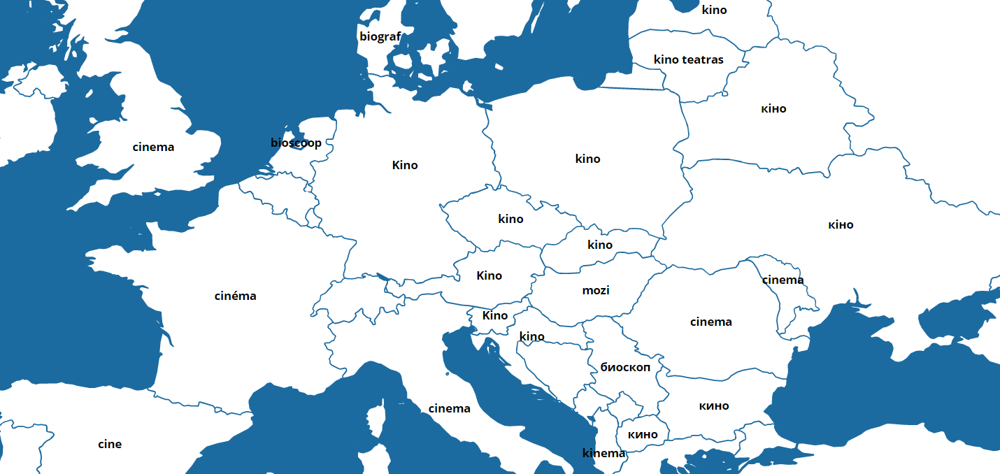

# TranslationMap
Visualize the differences and similarities of European languages on a map.  
Available at: [TranslationMap.cf](http://www.translationmap.cf)

## Uses
* [jVectorMap](http://jvectormap.com) for drawing the map
* [Yahoo Query Language](https://developer.yahoo.com/yql/) for data access
* [Canvg library](https://code.google.com/p/canvg/) for creating png's

## Inspiration
Inspired (in part) by these "rage comics" (apparently termed [differenze linguistiche](http://knowyourmeme.com/memes/differenze-linguistiche)):

